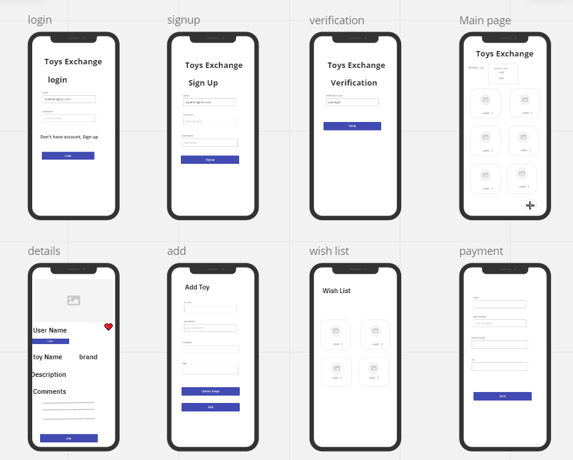

# Toys-Exchange

---------------------------------------------------------------------------------------------------------------------------------------
#### It is apparent that children quickly tire of their toys and move on to the next one as they grow. This is one of the most innovative mobile app ideas in 2022. It is for the community of parents whose children outgrow their toys quickly. Instead of buying brand new toys every few months’ parents can put their toys on the app and exchange them with other toys.

## **Wireframe:**

---------------------------------------------------------------------------------------------------------------------------------------

# **User Stories**

## **Story #1**

----------------------------------------------------------------------------------------------------------------------------------------

#### **Filtering**
#### Filter by ages and toys condition, I want the ability to make search by ingredients, so I can get the toys that I search for quickly.

#### **Feature Tasks:**
#### **- Exchange toys between people for free or with cheap price**

#### **Acceptance Tests:** make sure the user can filter by the conditions by choosing the condition.
#### Estimate your User Stories: Large.

## **Story #2**

----------------------------------------------------------------------------------------------------------------------------------------

#### **Add To List.**
#### As a user, I want to add toy to my wish list so that I can be back to this list and choose what the toy I want.

#### **Feature Tasks:**
#### **- Add the toy to the wish list.**
#### **- Save the wish List changes.**

#### **Acceptance Tests:** Ensure that the toy successfully save into database.
#### Estimate your User Stories : Large.

## **Story #3**

----------------------------------------------------------------------------------------------------------------------------------------

#### **Add own toy**
#### As a user, I want to add my own toys, so the others can see and buy my toys.

#### **Feature Tasks:**
#### **- Add toys to App**

### **Acceptance Tests:** Ensure that the users can add their own toys and show them in the App.
#### Estimate your User Stories : Small.

## **Story #4**

----------------------------------------------------------------------------------------------------------------------------------------

#### **comment on toys**
#### As a user, I want to add comment to a toy.

#### **Feature Tasks:**
#### **- Add the comment to the toy comments list.**
#### **- Save the comments List changes.**

#### **Acceptance Tests:** Ensure that the toy comment successfully save into database.
#### Estimate your User Stories : Small.

## **Story #5**

----------------------------------------------------------------------------------------------------------------------------------------

#### **delete toys that I added**
#### as a user I can delete from App

#### **Feature Tasks :**
#### **- delete toys**

#### **Acceptance Tests:** Ensure that the user can delete specific toy.
#### Estimate your User Stories : Extra Large.

----------------------------------------------------------------------------------------------------------------------------------------

## Domain Modeling

----------------------------------------------------------------------------------------------------------------------------------------

## DataBase Schema Diagram

